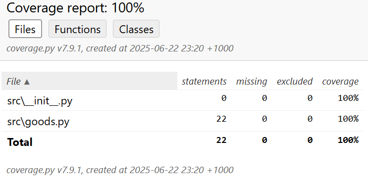

# shop

Учебный проект интернет-магазин

***

### Описание модулей
1. В Модуле "goods" представлены два класса Product и Category на основании которых можно создавать объекты.

---

### Установка и использование

- Установите [Python](https://www.python.org/downloads/)
- Установить менеджер пакетов poetry при помощи pip:

```
pip install poetry
```

- Клонируйте проект с репозитория GitHub:

```
git clone https://github.com/Alex7270/shop.git
```

- Установите зависимости:

```
poetry update
```

- Запустите main.py:

```
python main.py
```

***


### Тестирование

- Установите через `Poetry` `Pytest`:

```commandline
poetry add --group dev pytest
```

- Чтобы запустить тесты с оценкой покрытия, можно воспользоваться следующими командами:  
  `pytest --cov`  — при активированном виртуальном окружении.  
  `poetry run pytest --cov` — через poetry.  
  `pytest --cov=src --cov-report=html` — чтобы сгенерировать отчет о покрытии в HTML-формате.   
  где `src` — пакет c модулями, которые тестируем.   
  Отчёт будет сгенерирован в папке `htmlcov` и храниться в файле с названием `index.html`.

- Oтчёт в HTML будет выглядеть следующим образом:

   
Произведены тесты для функций модуля `goods`.   
Тестами покрыто 100% кода


- Установите библиотеку `pytest-cov`:

```commandline
poetry add --group dev pytest-cov
```

---

### Документация и ссылки

При необходимости установите [PyCharm Community Edition
](https://www.jetbrains.com/pycharm/download/)


---

### Лицензия

---

